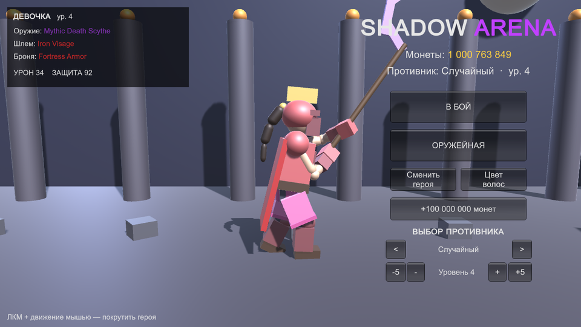
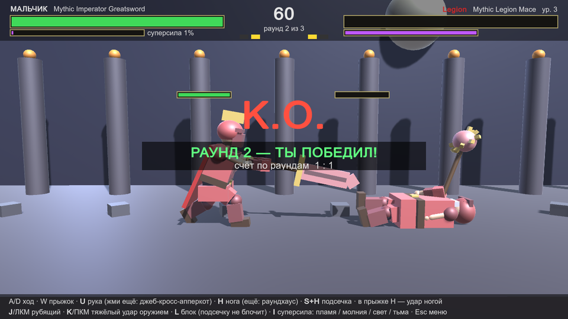
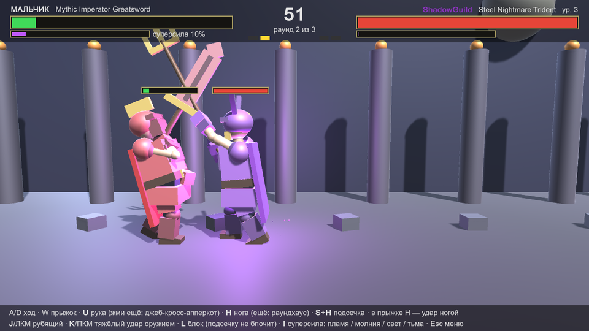

# Shadow Arena

3D-файтинг на Unity в духе Mortal Kombat и Shadow Fight: тяжёлое оружие в двух руках, удары руками и ногами, комбо, суперсилы и бои до двух побед.
Бой идёт по одной линии (2.5D), противник — бот. Вся графика строится из примитивов прямо в коде, внешних моделей, текстур и музыки в проекте нет.

| Меню | Конец раунда | Суперсила |
|---|---|---|
|  |  |  |

## Возможности

**Бой**
- Матч до двух побед из трёх раундов, таймер 60 секунд. Если время вышло, побеждает тот, у кого больше здоровья. После каждого раунда показывается, кто победил.
- Оружие держится двумя руками (руки подстраиваются под рукоять). Рубящий и тяжёлый удар с нокдауном.
- Руки и ноги: джеб, кросс, апперкот; фронтальный удар и раундхаус; подсечка; удар ногой в прыжке. Удары рукой и ногой продолжаются в комбо.
- Блок с прочностью: слишком долгий блок пробивается. Подсечку блоком не остановить.
- Криты, остановка кадра при попадании, тряска камеры, нокдаун и вставание.

**Суперсила** копится сама: со временем, за нанесённый урон и за полученный. Между раундами шкала сохраняется. У каждой фракции своя суперсила:

| Фракция | Стиль | Суперсила |
|---|---|---|
| Легион | тяжёлое оружие, урон ×1.3, медленнее | **Пламя** — огненная волна, враг горит 5 секунд |
| Династия | быстрые серии, нунчаки | **Молния** — удар с неба, блоком не остановить, враг парализован |
| Вестники | точность: длинный выпад, крит 22%, катана | **Свет** — колонна света, всегда крит, лечит владельца |
| Гильдия Теней | быстрые удары, крит 12% | **Тьма** — щупальца, забирают часть урона в здоровье, яд |

**Персонажи и экипировка**
- Мальчик или девочка (у девочки хвостик, который качается при движении, и розовая юбка), цвет волос на выбор. У каждого свой голос при ударе.
- 63 вида оружия, 16 шлемов и 16 видов брони у четырёх фракций. Оружие: мечи, катана, двуручный меч, топор, копьё, алебарда, молот, булава, коса, трезубец, кинжалы, нунчаки. Всё видно на персонаже и меняется в оружейной сразу.
- Броня и шлемы двигаются вместе с телом и различаются по стилю: наплечники, наручи, поножи, гребни, рога, маски, плащ.
- Стартовый баланс — 999 999 999 монет. За победу в матче даётся `50 000 × уровень`, за поражение 5 000.

**Противник**
В меню выбирается фракция противника (или случайная) и его уровень от 1 до 30. После победы уровень растёт на единицу.

**Звук**
Музыка (меню и бой) и все эффекты синтезируются кодом при запуске. Вокальные вскрики — короткие WAV-файлы в `Assets/Resources/Voice`.

## Управление

| Клавиша | Действие |
|---|---|
| `A` / `D` | ход |
| `W` / `Space` | прыжок |
| `U` | удар рукой (жми ещё: джеб → кросс → апперкот) |
| `H` | удар ногой (ещё раз: раундхаус) |
| `S` + `H` | подсечка |
| `W`, потом `H` | удар ногой в прыжке |
| `J` / ЛКМ | рубящий удар оружием |
| `K` / ПКМ | тяжёлый удар оружием |
| `L` | блок |
| `I` | суперсила (когда шкала полная) |
| `M` | выключить музыку |
| `Esc` | выйти в меню |

В меню героя можно покрутить мышью (зажать ЛКМ).

## Запуск

Нужен Unity **6000.0.77f1** (Unity 6), встроенный рендер-пайплайн, дополнительные пакеты не требуются.

1. Открой папку проекта в Unity Hub (`Add → Add project from disk`).
2. Нажми **Play**. Сцену собирать не нужно: игра создаёт себя сама при запуске.

Готовый билд для Windows: меню **Shadow Arena → Build Windows x64** или запусти `build.bat`. Результат: `Build/ShadowArena.exe`.
`play.bat` открывает проект в редакторе и сразу включает Play. Путь к Unity в `.bat` файлах прописан под `C:\Program Files\Unity\Hub\Editor\6000.0.77f1`, поправь, если у тебя другой.

Прогресс (монеты, покупки, уровень, выбор героя) хранится в `PlayerPrefs`.

## Структура проекта

```
Assets/
  Scripts/
    GameMain.cs    меню, выбор героя, магазин, раунды, интерфейс
    Fighter.cs     скелет бойца, анимации, удары, ИИ бота, суперсилы, эффекты
    Items.cs       база предметов: оружие, шлемы, броня, характеристики фракций
    GameAudio.cs   синтез музыки и звуков, озвучка боли
  Editor/
    Builder.cs     сборка .exe из меню Unity или командной строки
    Launcher.cs    запуск проекта сразу в Play
  Resources/Voice/ голосовые вскрики (мальчик и девочка)
docs/              скриншоты для README
```

## Для разработки

Игру можно запустить в служебных режимах (аргументы командной строки у `.exe`):

| Аргумент | Что делает |
|---|---|
| `-demo` | бот против бота, с автоматическими скриншотами |
| `-natural` | демо без читов, в логе видно накопление суперсилы |
| `-fastko` | в демо игрок бьёт сильнее, раунды заканчиваются быстро |
| `-female` | в демо играет девочка |
| `-weapon=ID` | в демо выбрать оружие по id, например `W_2_5_3` |
| `-menushot` | сохранить кадр меню и выйти |

Скриншоты пишутся в папку из переменной окружения `SA_SHOTS`.
Id оружия имеют вид `W_<фракция>_<тип>_<уровень>`, например `W_0_6_3` — мифический двуручный меч Легиона.

## Примечания

- Вокальные вскрики сгенерированы встроенными голосами речи Windows. Для личного использования этого достаточно; если будешь распространять игру, проверь условия лицензии на голоса или подложи свои записи в `Assets/Resources/Voice` (имена `pm_l0…pm_h2` — мальчик, `pf_l0…pf_h2` — девочка; `l` — лёгкий удар, `h` — сильный).
- Игра одиночная, только против бота.
